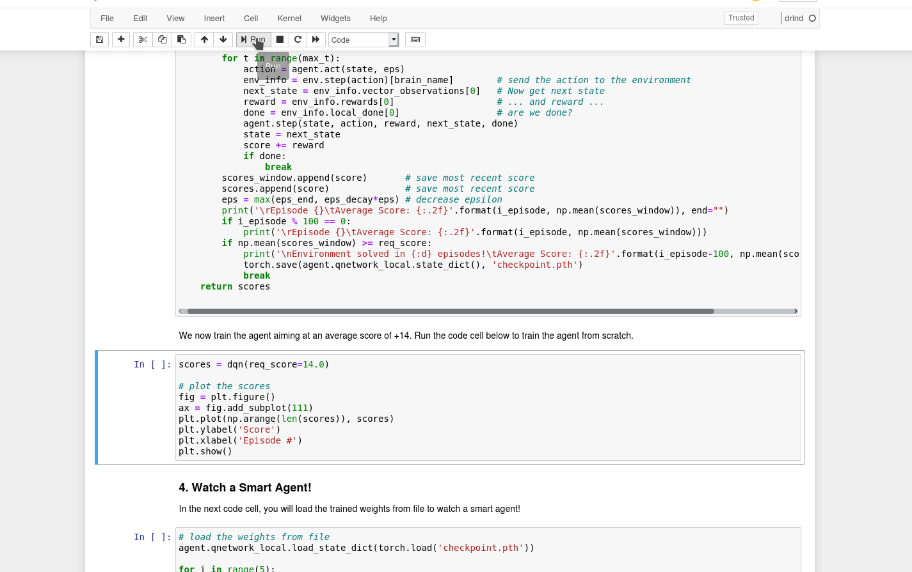
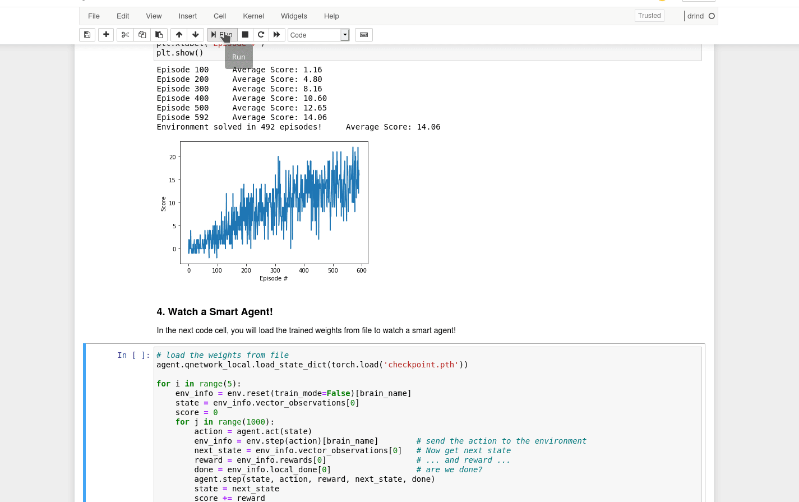

[//]: # (Image References)

[image1]: https://user-images.githubusercontent.com/10624937/42135619-d90f2f28-7d12-11e8-8823-82b970a54d7e.gif "Trained Agent"
[image2]: https://user-images.githubusercontent.com/10624937/42386929-76f671f0-8106-11e8-9376-f17da2ae852e.png "Kernel"

# Deep Reinforcement Learning Navigation

### Introduction

This project demonstrates how to train an agent to navigate and collect bananas in a large, square world.  

This project uses Jupyter and the Unity ML-Agents environment as part of the first project of the [Deep Reinforcement Learning Nanodegree](https://www.udacity.com/course/deep-reinforcement-learning-nanodegree--nd893) assignments.

![Trained Agent][image1]

A reward of +1 is provided for collecting a yellow banana, and a reward of -1 is provided for collecting a blue banana.  Thus, the goal of your agent is to collect as many yellow bananas as possible while avoiding blue bananas.  

The state space has 37 dimensions and contains the agent's velocity, along with ray-based perception of objects around agent's forward direction.  Given this information, the agent has to learn how to best select actions.  Four discrete actions are available, corresponding to:
- **`0`** - move forward.
- **`1`** - move backward.
- **`2`** - turn left.
- **`3`** - turn right.

The task is episodic, and in order to solve the environment, your agent must get an average score of +13 over 100 consecutive episodes.

### Build Dependencies

It is recommended to use a `conda` variant. Start [here](https://docs.conda.io/projects/conda/en/latest/user-guide/install/download.html) for instructions on how to install either `miniconda` or `anaconda`.

To set up your python environment to run the code in this repository, follow the instructions below.

1. Create (and activate) a new environment with Python 3.6.

	```bash
	conda create --name drlnd python=3.6
	conda activate drlnd
	```
	
3. Clone the Udacity Deep Reinforcement Learning repository, and navigate to the `python/` folder.  Then, install required dependencies.
```bash
git clone https://github.com/udacity/deep-reinforcement-learning.git
cd deep-reinforcement-learning/python
pip install .
```

4. Create an [IPython kernel](http://ipython.readthedocs.io/en/stable/install/kernel_install.html) for the `drlnd` environment.  
```bash
python -m ipykernel install --user --name drlnd --display-name "drlnd"
```

5. Before running code in a notebook, change the kernel to match the `drlnd` environment by using the drop-down `Kernel` menu. 

![Kernel][image2]

6. Download the environment from one of the links below.  You need only select the environment that matches your operating system:
    - Linux: [click here](https://s3-us-west-1.amazonaws.com/udacity-drlnd/P1/Banana/Banana_Linux.zip)
    - Mac OSX: [click here](https://s3-us-west-1.amazonaws.com/udacity-drlnd/P1/Banana/Banana.app.zip)
    - Windows (32-bit): [click here](https://s3-us-west-1.amazonaws.com/udacity-drlnd/P1/Banana/Banana_Windows_x86.zip)
    - Windows (64-bit): [click here](https://s3-us-west-1.amazonaws.com/udacity-drlnd/P1/Banana/Banana_Windows_x86_64.zip)
    
    (_For Windows users_) Check out [this link](https://support.microsoft.com/en-us/help/827218/how-to-determine-whether-a-computer-is-running-a-32-bit-version-or-64) if you need help with determining if your computer is running a 32-bit version or 64-bit version of the Windows operating system.

    (_For AWS_) If you'd like to train the agent on AWS (and have not [enabled a virtual screen](https://github.com/Unity-Technologies/ml-agents/blob/master/docs/Training-on-Amazon-Web-Service.md)), then please use [this link](https://s3-us-west-1.amazonaws.com/udacity-drlnd/P1/Banana/Banana_Linux_NoVis.zip) to obtain the environment.

2. Place the file inside your local copy of this GitHub repository, and decompress the file. 

### Instructions

Follow the instructions in `Navigation.ipynb` to get started with training your own agent!  

A screenshot showing the training process. It is not apparent, but the training is going through the episodes much faster than the video is showing.



A screenshot showing the agent using the estimated action-value function on one of the episodes.



